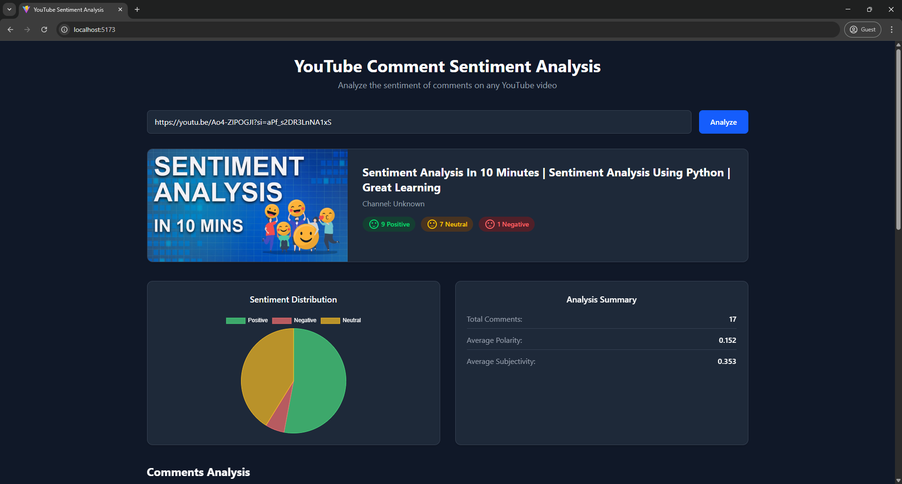
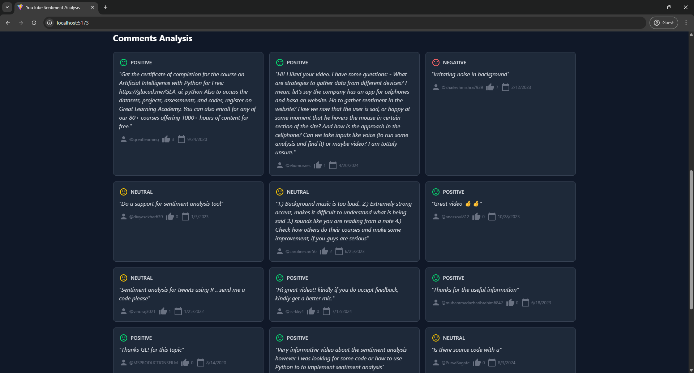

# ▶️YouTube Comment Sentiment Analysis




## 📌 Overview

A web application that analyzes the sentiment of YouTube comments using Natural Language Processing (NLP). Users can input any YouTube video URL, and the system will fetch and analyze the comments to determine overall sentiment distribution (positive, negative, neutral).

## 🛠 Technologies Used

### Frontend

- **React.js** (with Vite) - Frontend framework
- **Tailwind CSS** - Utility-first CSS framework
- **Chart.js** - Data visualization
- **Axios** - HTTP client

### Backend

- **Python Flask** - Web framework
- **TextBlob** - NLP library for sentiment analysis
- **Pytube** - YouTube data extraction
- **Google YouTube Data API** (optional) - For more reliable comment fetching
- **Pandas** - Data analysis

### Sentiment Analysis Algorithm

- Uses TextBlob's pattern analyzer which provides:
  - **Polarity**: Ranges from -1 (negative) to 1 (positive)
  - **Subjectivity**: Ranges from 0 (objective) to 1 (subjective)
- Classification thresholds:
  - Positive: polarity > 0.1
  - Negative: polarity < -0.1
  - Neutral: between -0.1 and 0.1

## 🚀 Features

- Real-time sentiment analysis of YouTube comments
- Beautiful data visualization with interactive charts
- Responsive design works on all devices
- Multiple fallback methods for comment fetching
- Dark mode UI

## ⚙️ Setup Instructions

### Prerequisites

- Node.js (v16+)
- Python (3.8+)
- npm/yarn
- Git

### 1. Clone the Repository

```bash
git clone https://github.com/shayan-tej/youtube-sentiment-analysis.git
cd youtube-sentiment-analysis
```

### 2. Backend Setup

```bash
cd server
python -m venv venv
source venv/bin/activate  # On Windows: venv\Scripts\activate

# Install dependencies
pip install -r requirements.txt  # Create this file if it doesn't exist with: pip freeze > requirements.txt
python -m textblob.download_corpora # For TextBlob corpora

# Set up environment variables
cp .env.example .env
```

Edit the `.env` file:

```env
FLASK_APP=app.py
FLASK_ENV=development
YOUTUBE_API_KEY=your_api_key_here
```

### 3. Run the Application

In separate terminal windows:

**Backend:**

```bash
cd server
flask run
```

**Frontend:**

```bash
cd client
npm run dev
```

The application should now be running at `http://localhost:5173`

## 🔑 Environment Variables

The project uses `.env` files for configuration:

- `YOUTUBE_API_KEY`: Google API key for more reliable comment fetching
- `FLASK_ENV`: Set to "development" or "production"

## 🌐 API Endpoints

- `POST /analyze` - Main analysis endpoint
  - Parameters: `url` (YouTube URL), `max_comments` (optional)
  - Returns: Video metadata, comments, and sentiment analysis

## 🤖 How It Works

1. User submits a YouTube URL
2. Backend extracts video ID and fetches comments using:
   - Primary method: YouTube Data API (if key provided)
   - Fallback method: Pytube + web scraping
3. Each comment is processed with TextBlob for sentiment analysis
4. Results are aggregated and returned to frontend
5. Frontend visualizes the sentiment distribution

## 📂 Project Structure

```text
youtube-sentiment/
├── client/               # Frontend (React)
│   ├── public/
│   ├── src/
│   │   ├── components/   # React components
│   │   ├── hooks/        # Custom hooks
│   │   └── App.jsx       # Main component
├── server/              # Backend (Flask)
│   ├── app.py           # Main application
│   └── requirements.txt # Python dependencies
├── .gitignore
└── README.md
```

## 📜 License

MIT License

## 🙏 Acknowledgments

- TextBlob for sentiment analysis
- Chart.js for data visualization
- Pytube for YouTube data access
